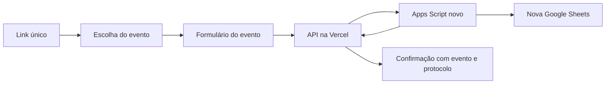

# Formulário de inscrição para dois eventos

Status: proposta original preservada abaixo. A primeira versão local foi implementada após autorização do usuário; o README descreve o escopo entregue e a instalação. Nenhuma aplicação foi publicada e nenhum recurso do projeto anterior foi alterado.

## Referências e limites da análise

- Repositório informado: https://github.com/everton-web/formulario_credenciamento
- Planilha informada: https://docs.google.com/spreadsheets/d/12krMHzgukGb46xxsjpmRjj715LN-rwoaXWwm-hbT5EA/edit
- `Pasted markdown.md`: Apps Script de inscrições, funções, vagas, municípios/NTE e exportação de pendentes. Analisado.
- `Pasted markdown (2).md`: Apps Script de geração de declarações e envio de e-mails. Analisado.

O repositório foi acessado posteriormente pela API pública do GitHub, e seu `index.html` foi analisado. O frontend usa HTML, CSS e JavaScript sem framework, com validação dos dígitos verificadores do CPF, campos condicionais e chamadas diretas ao Apps Script. O conteúdo da planilha ainda não foi acessado; os números abaixo são os padrões do código anexado, não uma confirmação de vagas atuais. Os anexos apresentam escapes de Markdown e não devem ser copiados literalmente como código executável.

## Definições recebidas: EPT e EJA

O usuário definiu os nomes EPT e EJA e informou que os eventos tratam dos resultados dessas avaliações. Ambos reutilizarão o formulário e a proposta visual do repositório informado. Identificadores propostos: `ept` e `eja`.

Atualização recebida: EPT em 7 de outubro e EJA em 8 de outubro. Considerar 2026 pelo contexto do projeto, explicitado ao usuário; o ano não foi escrito na mensagem das datas. Funções do formulário original mantidas. O mesmo CPF pode participar dos dois eventos, com bloqueio de inscrição repetida dentro de cada evento.

O usuário confirmou 250 inscrições por evento: EPT tem limite total de 250 e EJA tem limite total de 250, controlados independentemente. O limite total de cada evento deve ser respeitado junto às cotas aplicáveis por função, município ou NTE. O usuário atualizará as vagas na nova planilha quando a criar; não reaproveitar automaticamente os limites antigos por função. Os limites e sua distribuição serão lidos da nova planilha, sem necessidade de alterar o frontend. Local, horário e período de inscrições continuam pendentes.

Campos comuns confirmados pela escolha do formulário existente: nome completo, CPF, telefone, e-mail e função/instituição. Preservar os campos condicionais de função municipal + município e número do NTE + função no NTE. A lista de funções do formulário original foi confirmada; limites e distribuição de vagas serão definidos na nova planilha.

Referência visual fixada por solicitação do usuário: painel informativo com fotografia e sobreposição azul à esquerda; formulário branco à direita; fonte Inter; títulos e rótulos azuis; ação principal vermelha; campos com cantos de 8 px; disposição vertical no celular. Usar o mesmo padrão na escolha inicial EPT/EJA, mantendo o evento selecionado visível durante o preenchimento.

Os tokens do código de referência são azul `#1a3a8a`, azul escuro `#0f2560`, vermelho de ação `#d42b2b`, superfície branca e fundo de campo `#f7f8fa`. A imagem `background.webp` consta no repositório. O brasão deve usar um arquivo local conferido; o HTML antigo aponta para uma URL externa com parâmetro de expiração.

Não herdar o título SABE 2025, a data/local/horário antigos, o prazo de 05/07/2026 ou o aviso de proibição de inscrição presencial sem definição para EPT/EJA. A mesma estrutura de formulário não implica automaticamente as mesmas cotas ou a mesma política de CPF entre eventos.

## O que existe nos anexos

O primeiro script usa as abas `Inscricoes`, `Funcoes`, `Vagas` e `Municípios`. `doGet`, com a ação `getDadosIniciais`, entrega limites, contagens e municípios ocupados. `doPost`, com a ação `inscrever`, verifica duplicidade e cotas e grava oito colunas: Data/Hora, Nome, CPF, Telefone, Municipio, E-mail, Funcao e NTE.

A duplicidade compara o CPF recebido com a coluna da planilha, globalmente. Não há validação dos dígitos verificadores no `doPost` anexado; essa validação foi confirmada no frontend do GitHub e também deverá existir no novo backend.

O código prevê cotas institucionais, um conjunto compartilhado de vagas para Secretário(a) Municipal e Técnico Municipal e um representante municipal por município. O limite municipal padrão é 417. Para NTE, o padrão é uma vaga de Diretor(a) e uma de Ponto Focal por NTE, com duas de Ponto Focal no NTE 19. São referências históricas, não regras assumidas para os novos eventos.

Há catálogo de municípios e associação a NTE, painéis e exportação de pendentes para outra planilha. O segundo script trabalha separadamente com a aba `Secretarios Inscritos`, modelo Google Docs, pasta de PDFs e envio por Gmail. Possui modos de teste/rascunho e colunas para acompanhar geração e envio.

## Arquitetura proposta



Um único projeto no novo repositório, com frontend compartilhado e configurações próprias para cada evento. A página inicial oferece os dois eventos; cada formulário mantém o nome do evento visível e permite voltar à escolha. Campos e opções são carregados conforme o identificador estável `eventoId`.

Proposta técnica revisada após acesso ao repositório: preservar HTML, CSS e JavaScript do formulário existente, separando configuração e lógica compartilhada em arquivos próprios; usar funções da Vercel em `/api` para intermediar as chamadas e Apps Script para validar regras e persistir dados. Não é necessário introduzir um framework nem duplicar a aplicação para cada evento.

A API da Vercel mantém a URL do Apps Script e o segredo da integração no servidor. O Apps Script valida o segredo recebido pela integração; nenhuma credencial vai para o navegador ou para o repositório. A API expõe somente configurações públicas, disponibilidade agregada e resultados de inscrição, nunca listas de pessoas ou CPFs. A intermediação também centraliza tratamento de erros e evita dependência de chamadas diretas entre o navegador e o domínio do Apps Script.

Documentação técnica consultada: [Vercel Functions](https://vercel.com/docs/functions) e [Apps Script Content Service](https://developers.google.com/apps-script/guides/content). O cliente da integração deve seguir os redirecionamentos do Content Service.

## Organização da nova planilha

| Aba | Finalidade |
|---|---|
| Eventos | ID, nome, descrição, datas, local, período de inscrições, status e versão de configuração |
| Campos | Campos comuns e específicos, obrigatoriedade e opções por evento |
| Funcoes | Funções/instituições permitidas em cada evento, com identificadores estáveis |
| RegrasVagas | Evento, regra, grupo de funções, escopo territorial e limite |
| MunicipiosNTE | Catálogo comum de municípios e vínculos com NTE, revisado antes da ativação |
| Inscricoes | Base única, sempre identificando o evento |
| Vagas | Painel derivado por evento e regra de cota |
| PendenciasMunicipais | Municípios elegíveis ainda sem representação, por evento |

Colunas propostas para `Inscricoes`:

`InscricaoID | EventoID | EventoNome | DataHora | Nome | CPF | Telefone | MunicipioID | Municipio | Email | FuncaoID | Funcao | NTE | Status | VersaoConfiguracao | ChaveRequisicao | CamposExtrasJSON`

CPF e telefone são texto para preservar zeros iniciais. EventoID identifica permanentemente o evento; EventoNome registra o nome no momento da inscrição. Campos específicos conhecidos podem receber colunas próprias para facilitar relatórios; o JSON fica reservado a extensões. Leituras devem localizar colunas por cabeçalho, evitando dependência da posição das oito colunas antigas.

As configurações administrativas vivem na nova planilha e são validadas pelo Apps Script. O frontend recebe sua representação pública. Alterações inválidas não podem abrir inscrições; configuração incompleta mantém o evento em rascunho.

## Regras independentes

- Todas as consultas, contagens, relatórios e gravações exigem `eventoId` válido.
- Política de duplicidade confirmada: impedir a repetição de CPF no mesmo evento e permitir que a mesma pessoa se inscreva em EPT e EJA.
- Cotas podem ser por evento, função/instituição, município, NTE + função ou grupo compartilhado de funções. Uma inscrição precisa respeitar todas as cotas aplicáveis.
- Grupos compartilhados possuem seu próprio limite: não somar duas vezes as vagas quando duas funções usam a mesma cota.
- Limite zero significa nenhuma vaga. Ausência de configuração significa erro de configuração; vagas ilimitadas só existem quando explicitamente definidas.
- Funções, municípios e NTEs precisam pertencer às opções autorizadas do evento. O backend rejeita valores inventados, inclusive combinações territoriais inválidas.
- Prazos são verificados no servidor, com fuso explicitamente definido. Eventos encerrados não recebem novas inscrições.
- O catálogo territorial pode ser comum, mas elegibilidade, ocupação e pendências pertencem a cada evento. Não herdar automaticamente as exceções antigas.

## Confirmação e concorrência

O navegador valida campos para orientar a pessoa; o Apps Script repete as validações obrigatórias, incluindo normalização e dígitos verificadores de CPF. O sistema não deve considerar CPF matematicamente válido como prova de identidade.

O envio inclui evento, dados e uma chave de requisição. No Apps Script, adquirir `LockService.getScriptLock()` antes de reler inscrições, conferir duplicidade/cotas e gravar. Liberar o bloqueio em `finally`; em indisponibilidade, retornar erro temporário controlado. Isso impede que duas requisições da aplicação consumam a mesma última vaga. Todas as rotinas que alteram ocupação devem seguir o mesmo mecanismo; edições manuais de inscrições exigem procedimento administrativo próprio.

A chave de requisição permite devolver o resultado já registrado quando a pessoa repete o envio após uma falha de conexão. A mesma chave com conteúdo diferente deve ser rejeitada. A confirmação só ocorre após a gravação e contém evento e protocolo.

Painéis e notificações são derivados posteriores. No código antigo, `atualizarTudo()` acontece depois de `appendRow`, dentro do mesmo tratamento de erro: uma falha de painel pode informar falha de inscrição apesar de a linha já existir. Separar essas etapas no novo projeto.

O bloqueio é um recurso nativo documentado pelo Google: [LockService](https://developers.google.com/apps-script/reference/lock/lock-service). Não transforma a planilha em banco transacional; volume e pico esperados precisam ser conhecidos e testados.

## Declarações e e-mails

Manter como módulo opcional, separado da inscrição. Se estiver no escopo, cada evento terá modelo, pasta, assunto, remetente autorizado e critérios de emissão próprios. Inscrição não deve equivaler automaticamente a presença.

Separar estados de geração, rascunho, teste, envio real e erro. No anexo, qualquer valor em `Enviado em` faz pular a linha, incluindo erros e testes; isso atrapalha novas tentativas. Preservar também o número real da linha ao ignorar linhas vazias, para não atualizar o registro errado. Identificar o envio por inscrição/evento e finalidade, evitando bloqueio global pelo e-mail.

Não reutilizar IDs de planilhas, modelos, pastas, destinatários ou gatilhos antigos no novo ambiente. A exportação automática de pendentes é uma opção a confirmar.

## Organização prevista do repositório

```text
src/                 página inicial, formulário compartilhado e validações de interface
api/                 configurações públicas e envio para Apps Script
apps-script/         API, regras, persistência, painéis e módulo opcional de declarações
docs/                esquema da planilha, configuração e publicação
tests/               regras de duplicidade, cotas, concorrência e reenvio
.env.example         somente nomes de variáveis e exemplos sem credenciais
```

A nova planilha será privada; o site publica somente o formulário e informações do evento. Dados pessoais não entram no GitHub, em URLs ou em registros de diagnóstico. Entradas de texto precisam ser gravadas como texto literal na planilha, sem execução de fórmulas.

## Informações necessárias

Preencher para cada evento:

| Tema | Definição necessária |
|---|---|
| Identificação | EPT e EJA definidos; faltam eventual título por extenso, descrição e organização responsável |
| Realização | EPT: 07/10; EJA: 08/10; ano 2026 considerado pelo contexto. Faltam horário e local/endereço ou modalidade online |
| Inscrições | Abertura, encerramento, fuso e eventual encerramento antecipado |
| Público | Funções/instituições do formulário original mantidas; informar eventuais critérios adicionais |
| Vagas | Confirmado: 250 para EPT e 250 para EJA, com controle independente. Distribuição por função, município/NTE e exceções será atualizada na nova planilha |
| Território | Municípios/NTEs participantes e se há limite de representantes por município |
| Formulário | Mesmos campos do GitHub definidos; informar somente eventuais exceções ou acréscimos |
| CPF | Definido: a mesma pessoa pode participar dos dois, uma inscrição por evento |
| Resultado | Confirmação imediata ou análise; lista de espera, cancelamento e substituição |
| Comunicação | Texto final, contato de suporte e necessidade de e-mail de confirmação |
| Presença/documentos | Necessidade de controle de presença e declarações/certificados |
| Identidade visual | Proposta visual do GitHub definida; informar somente eventual troca de logos ou imagens |
| Dados pessoais | Texto de privacidade e responsáveis pelo acesso e retenção |
| Operação | Volume esperado e pico de acessos no início das inscrições |

Para integração/publicação: URL da nova planilha; conta Google responsável pelo Apps Script; conta/organização e nome do novo repositório; projeto/equipe Vercel e domínio desejado. Informar identificadores e acessos pelos meios apropriados, sem enviar senhas na conversa.

O frontend do repositório já foi acessado e analisado. Falta conferir a estrutura real da planilha; se o link continuar indisponível, uma cópia apenas da estrutura/configuração, sem inscrições pessoais, é suficiente para complementar a análise.

## Validação prevista antes da publicação

1. Inscrição em um evento não altera disponibilidade do outro.
2. CPF repetido é tratado conforme a política definida; CPF inválido é recusado no servidor.
3. Duas solicitações simultâneas à última vaga produzem somente uma inscrição confirmada.
4. Reenvio após perda de resposta não cria segunda inscrição nem consome nova vaga.
5. Cotas institucionais, municipais compartilhadas e por NTE respeitam limites e exceções.
6. Evento encerrado, evento desconhecido e função não autorizada são rejeitados.
7. Erro no painel ou no e-mail não desfaz nem mascara uma inscrição já gravada.
8. Navegação e erros do formulário funcionam no celular e com teclado.
9. Ambiente de testes usa planilha própria e dados fictícios; a ativação de produção ocorre somente com as configurações finais.

Próxima etapa: receber período de inscrições, local/horário e a nova planilha com a distribuição de vagas. Nomes, dias dos eventos, funções, formulário-base, direção visual, limite total de 250 inscrições por evento e política de CPF por evento já estão definidos. Esta entrega contém arquitetura e levantamento, conforme solicitado antes da implementação das regras.
